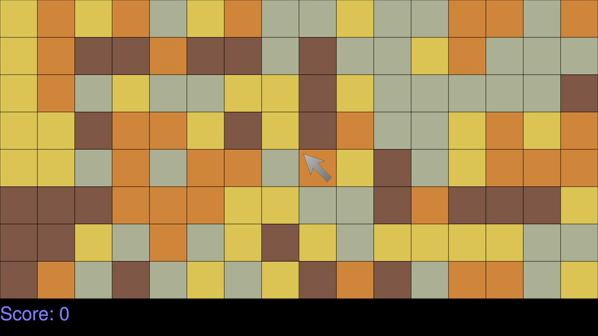

# switch-shot
Same Game (Chain Shot!) clone for the Nintendo Switch

This game is a work in progress!

## Roadmap
Ehh, this is just small project to get my hands rewettened with SDL, as I have used the now abandoned RubyGame binding for SDL some 12-13 years ago. And to get back into good old Nintendo homebrew!

Maybe I'll get ambitious and toss in some more features, and UI considering the following:
* Difficulty settings. (Ensuring every game has a solution).
* Configurable color palettes.
* Graphics for tiles instead of single colors.
* High score boards (Global) / Daily challenges.

## Screenshots

## Controls
* Up/Down/Left/Right (Joystick or D-Pad) moves the cursor.
* X to restart with the current seed.
* - for new game with new seed.
* + to go back to hbmenu.

## Compiling
### Prerequisites
* [devkitPro](https://devkitpro.org/wiki/Getting_Started) with libnx and the following packages installed
    * switch-sdl2
    * switch-sdl2_image
    * switch-sdl2_ttf

1) Once all of the above is in order simply type `make nro` to build.
2) Or `make yuzu` to run it in the Yuzu Nintendo Switch Emulator (requires `yuzu` to be installed and in your `$PATH`)

## Credits
Cursor graphic is mine (Willing to accept pull requests for better ones).

devkitpro team and SDL2 (and friends) team.

[OpensourceDesign](https://github.com/opensourcedesign/fonts/tree/master/gnu-freefont_freesans) for FreeSans.ttf

A special thanks to [grimfang4](https://github.com/grimfang4) for his NFont library (and utilities) which I remember using 12-13 years ago and surprised to still see being maintained!
